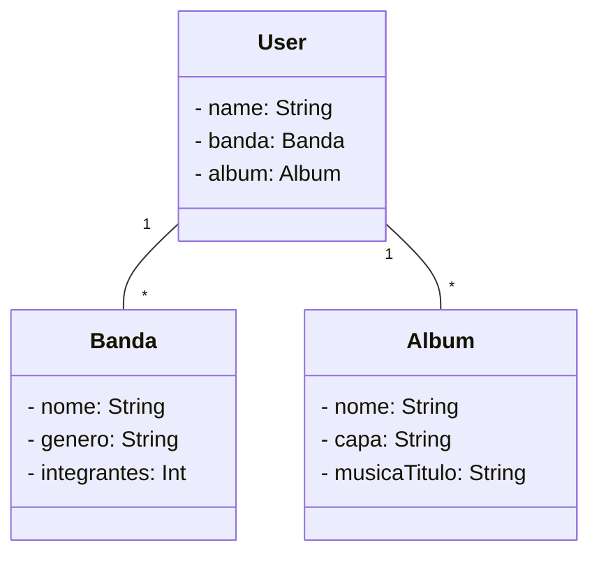

# API de Catalogação de Bandas

Esta é uma API Restful simples para catalogar informações sobre bandas musicais.

## Recursos Principais

- **Bandas**: Gerencie informações sobre bandas, incluindo nome, gênero e número de integrantes.
- **Álbuns**: Registre detalhes de álbuns, como nome, capa e títulos de músicas, associados a bandas.
- **Usuários**: Registre usuários para gerenciar bandas e álbuns associados.

