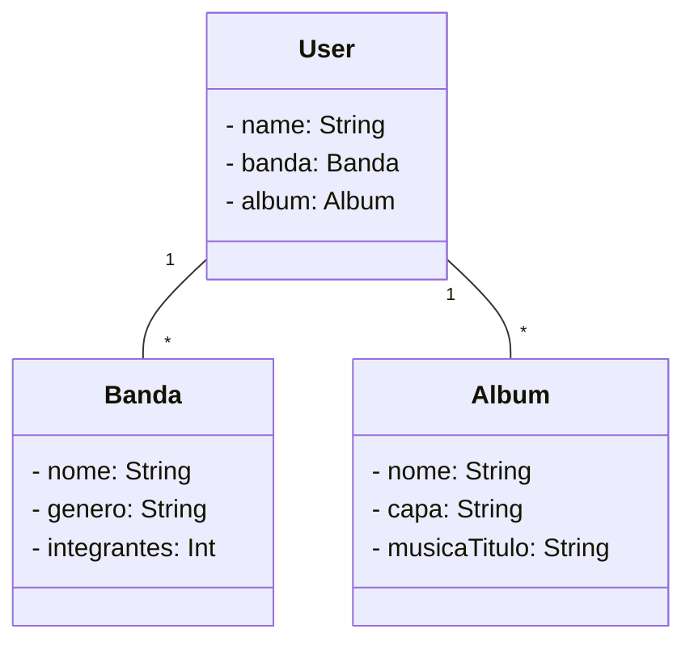

# desafio-restful

```mermaid
classDiagram
  class User {
    - name: String
    - banda: Banda
    - album: Album
  }

  class Banda {
    - nome: String
    - genero: String
    - integrantes: Int
  }

  class Album {
    - nome: String
    - capa: String
    - musicaTitulo: String
  }

  User "1" -- "*" Banda
  User "1" -- "*" Album
```
